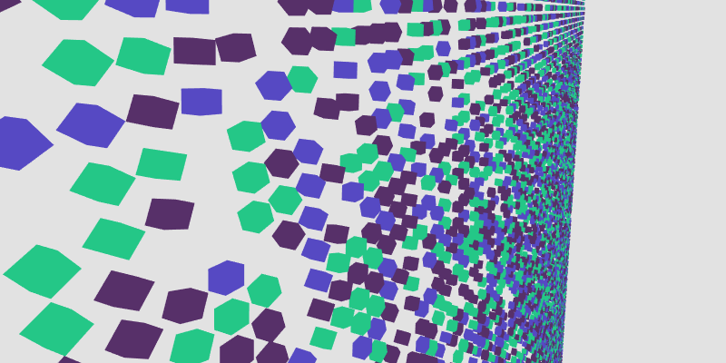
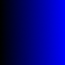

# aframe-tilemap

A set of [A-Frame](https://aframe.io/) components that render a static tilemap
from a specially coded image source and a set of reference entities. It
includes three components with different underlying implementations: [`tilemap-cloned`](#cloned-tilemaps-tilemap-cloned), [`tilemap-merged`](#merged-tilemaps-tilemap-merged), and [`tilemap-instanced`](#instanced-tilemaps-tilemap-instanced).

<p align="center"></p>

## Usage

```html
<a-scene>
  <a-assets>
    <a-asset-item id="milkTruck" src="assets/CesiumMilkTruck.glb"></a-asset-item>
    
  </a-assets>
  <a-entity tilemap-instanced="src: #tilemap-image" position="0 0 -20">
    <a-entity tile="id: 1" geometry="primitive: box" visible="false" scale="1 1 3"></a-entity>
    <a-entity tile="id: 2; readyEvent: model-loaded" gltf-model="#milkTruck" visible="false" scale="0.5 0.5 0.5"></a-entity>
    <a-entity tile="id: 3" geometry="primitive: sphere" visible="false"></a-entity>
  </a-entity>
  <a-sky color="#333"></a-sky>
</a-scene>
```

## API

Tilemaps are specified using a combination of `tilemap-*` and `tile` components.
An entity with the `tilemap-*` component represents the tilemap itself, and
should be transformed and attached to the desired part of the scene graph.

Entities that are direct children of the `tilemap-*` can include the `tile`
component to indicate that they represent one of the tile IDs that can be
specified in the tilemap. Their transformation relative to the origin of the
tilemap is replicated in each of their instances.

Usually, these tile entities should also have the component `visible="false"`.

### Tilemap Properties

| Property   | Type      | Description                                                                                                                                                                                                 | Default Value   |
| ---------- | --------- | ----------------------------------------------------------------------------------------------------------------------------------------------------------------------------------------------------------- | --------------- |
| src        | `asset`   | An image asset from which to derive the tile values                                                                                                                                                         |                 |
| tileWidth  | `number`  | Width of each tile in scene units                                                                                                                                                                           | 1               |
| tileHeight | `number`  | Height of each tile in scene units                                                                                                                                                                          | 1               |
| origin     | `vec2`    | Origin of the tilemap in normalized image coordinates. A value of (0,0) will render a tilemap whose entity center is the top-left corner, while a value of (1,1) will center the entity at the bottom right | `{x:0.5,y:0.5}` |
| debug      | `boolean` | Enables additional debug printing to console                                                                                                                                                                | `false`         |

### Tilemap Events

| Property     | Description                                                                                    |
| ------------ | ---------------------------------------------------------------------------------------------- |
| model-loaded | Tilemap completed loading.<br>_This emulates the behavior of other model loaders in A-Frame._ |

### Tile Properties

| Property   | Type     | Description                                                                                                                                                                                                                 |
| ---------- | -------- | --------------------------------------------------------------------------------------------------------------------------------------------------------------------------------------------------------------------------- |
| id         | `int`    | The ID value in the tilemap that this entity represents                                                                                                                                                                     |
| readyEvent | `string` | If specified, the tilemap will wait for this entity to emit this event before loading. This is needed for tiles that load assets (e.g. GLTF models).<br>_For most A-Frame loaders, listen for the event `model-loaded`._ |

## Tilemap Image Format

| Example: Square 128px Randomized-ID Tilemap |
| -------------------------------------------------------------------------------------------------------- |
|                                                               |
| IDs: *random, 0 to 3* | 
| Rotation: *0 to 360 deg from left to right* |

The image tilemap that determines where each tile is rendered contains only
two components: `ID` and `Rotation`. Images are expected to contain one byte
per channel of either RGB or RGBA information.

| Channel       | Size     | Description                                    |
| ------------- | -------- | ---------------------------------------------- |
| **R** (Red)   | `1 byte` | HIGH byte of the tile ID                       |
| **G** (Green) | `1 byte` | LOW byte of the tile ID                        |
| **B** (Blue)  | `1 byte` | Normalized rotation (`0 = 0°`, `255 = 358.5°`) |
| **A** (Alpha) | `1 byte` | _Unused_                                       |

The equations for determining the tile offets from the pixel value of the image are:
```
TILE_ID    = 256 * pixel.R + pixel.G
TILE_THETA = PI / 128.0 * pixel.B
```

Each pixel of the image represents one tile, with each column spaced at
`tileWidth` intervals and each row spaced at `tileHeight` intervals.

## Implementations

### Cloned Tilemaps: [`tilemap-cloned`](src/tilemap-cloned.js)

In the cloned tilemap, each tile location in the map is rendered by cloning the
`THREE.Object3D` represented in the reference tile with the matching ID.

This approach exactly reuses the `THREE.Geometry` and `THREE.Material`
associated with the reference tile, so it will not interfere with shaders or
other complex models. However, it is the least performant, as each tile is
handled as a completely different node in the scene graph.

### Merged Tilemaps: [`tilemap-merged`](src/tilemap-merged.js)

In the merged tilemap, each reference tile is decomposed into a list of
reference meshes. The geometry of each of these meshes is then duplicated at
each matching tile location, creating a single merged mesh that contains
geometry for all instances of the reference tile.

This method is much more performant than cloning, because each reference tile
mesh simply pushes one large geometry buffer to the GPU. However, it is very
memory intensive, because it must maintain the full geometric representation
of every tile location in memory.

### Instanced Tilemaps: [`tilemap-instanced`](src/tilemap-instanced.js)

In the instanced tilemap, each reference tile is pushed to the GPU, where a
vertex shader is applied to each child mesh that instead renders it at each
tile location.

This is the most performant of the three methods, as it only pushes each
reference tile to the GPU once, and it also only needs a small amount of memory
to maintain a buffer of tile locations to which each tile will be rendered.

One downside of this approach is that it requires the direct insertion of a
vertex shader into the material that is used to render the object. This limits
the material options for these objects. The implementation tries to replicate
the functionality of standard `THREE` source materials as best it can, but some
effects will not work properly, and all vertex shader effects are removed.

Another downside is that the rendered instances are not available outside
the GPU for other applications, such as raycasts or other physical checks.
For applications that require those, cloned or merged tilemaps may be a
better choice.

## License

This library is free software and is distributed under an MIT License.
